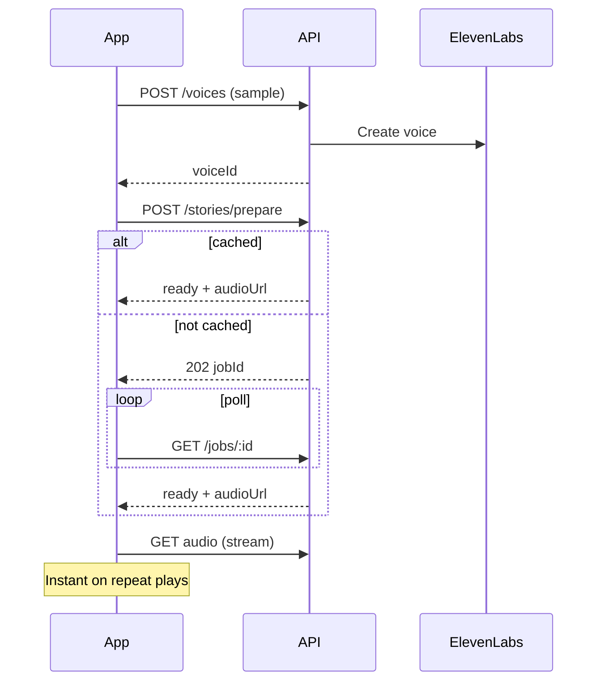

# Tap & Roar Voice API

Separate backend for **fast family-voice stories**. The static Tap & Roar site stays on GitHub Pages; this service handles voice cloning and narration.

## Why a backend?

| Friendly voice (browser TTS) | This API (XTTS) | This API (ElevenLabs) |
|------------------------------|-----------------|------------------------|
| Built-in, sentence-by-sentence | One smooth narration | One smooth narration |
| No setup | Local voice server | Cloud API key |
| Free | Free (local GPU/CPU) | Paid |

## Quick start (local)

### Option A — Coqui XTTS-v2 (free, local)

```bash
# Terminal 1 — Python XTTS sidecar
cd voice-api/xtts-service
python3 -m venv .venv && source .venv/bin/activate
pip install torch torchaudio
pip install -r requirements.txt
python server.py

# Terminal 2 — Node API
cd voice-api
cp .env.example .env   # VOICE_PROVIDER=xtts by default
npm install
npm run dev
```

First story generation downloads ~1.7 GB model weights and may take 30–90s on CPU/MPS; cached replays are instant.

### Option B — ElevenLabs (hosted, paid)

```bash
cd voice-api
cp .env.example .env
# Set VOICE_PROVIDER=elevenlabs and ELEVENLABS_API_KEY=...
npm install
npm run dev
```

### Option C — Mock (UI only)

Set `VOICE_PROVIDER=mock` in `.env` — no real audio.

API runs at **http://127.0.0.1:8787**

Frontend (separate terminal):

```bash
cd ..
python3 -m http.server 8765
# Open http://localhost:8765
```

Set in the browser console (until wired in UI):

```js
localStorage.setItem("tapRoarVoiceApi", "http://127.0.0.1:8787");
```

## API overview

### `POST /api/voices`

Upload family voice sample (multipart).

- `label` — e.g. "Mum"
- `file` — audio blob (webm, m4a, mp3, wav)

Response:

```json
{ "voiceId": "voice-abc123", "label": "Mum", "provider": "elevenlabs" }
```

### `POST /api/stories/prepare`

Start or fetch cached story narration.

```json
{
  "voiceId": "voice-abc123",
  "storyId": "cat-and-owl",
  "locale": "en",
  "text": "Full story text as one paragraph..."
}
```

- **200/ready** — audio already cached → `{ status: "ready", audioUrl }`
- **202** — generating → `{ status: "processing", jobId, audioUrl }`

### `GET /api/jobs/:jobId`

Poll generation progress.

```json
{ "status": "processing", "progress": 35, "audioUrl": null }
```

### `GET /api/stories/audio/:cacheKey`

Returns `audio/mpeg` — play directly in `<audio>`.

### `POST /api/voices/:voiceId/preview`

Short clone preview before saving stories.

## Client flow (fast UX)



1. Parent uploads sample once → `voiceId` stored in IndexedDB  
2. On **Play story** → `prepare` returns cached MP3 immediately when possible  
3. First time only → short poll, then play  
4. Repeat plays → **no wait**

## Environment

| Variable | Default | Purpose |
|----------|---------|---------|
| `VOICE_PROVIDER` | `xtts` | `xtts`, `elevenlabs`, or `mock` |
| `XTTS_SERVICE_URL` | `http://127.0.0.1:5002` | Local Coqui sidecar |
| `XTTS_LANGUAGE` | `en` | XTTS language code |
| `ELEVENLABS_API_KEY` | — | Only when `VOICE_PROVIDER=elevenlabs` |
| `PORT` | `8787` | Server port |
| `CORS_ORIGINS` | localhost:8765 | GitHub Pages origin later |
| `DATA_DIR` | `./data` | Cached audio + metadata |

## Deploy later (options)

- **Cloudflare Workers + R2** — edge API, cheap storage (good with GitHub Pages)
- **Fly.io / Railway** — simple Node deploy
- **VPS** — `npm start` behind nginx

We can pick one when you're ready.

## Privacy note

With **XTTS**, voice samples and story text stay on your machine (or your rented GPU). With **ElevenLabs**, samples are sent to their cloud. Add parent consent in the UI before upload. Do not send child voice — family narrator only.

## Project layout

```
voice-api/
  src/
    index.js          # Server entry
    config.js
    storage.js        # File cache + metadata
    jobs.js           # Async story generation
    routes/api.js     # HTTP routes
    providers/
      elevenlabs.js
      xtts.js
      mock.js
  xtts-service/       # Python Coqui XTTS sidecar
    server.py
    requirements.txt
```
